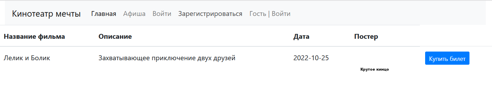
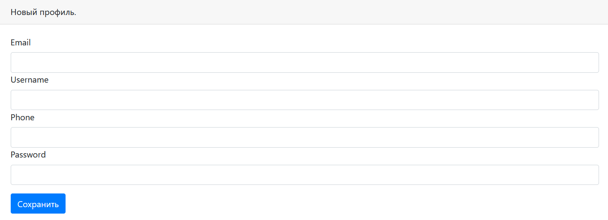
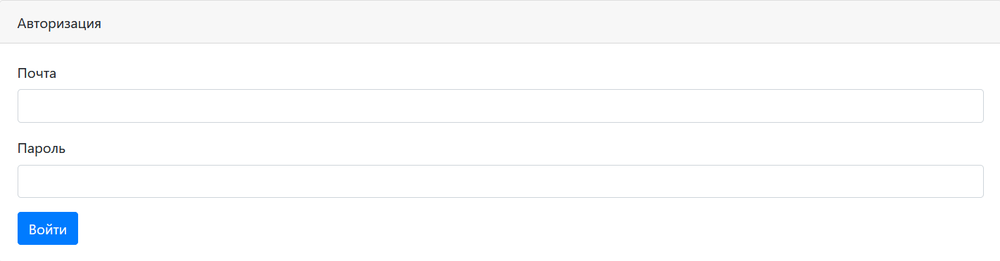
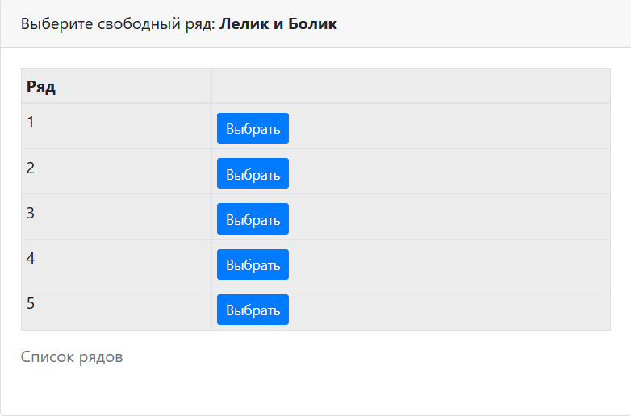
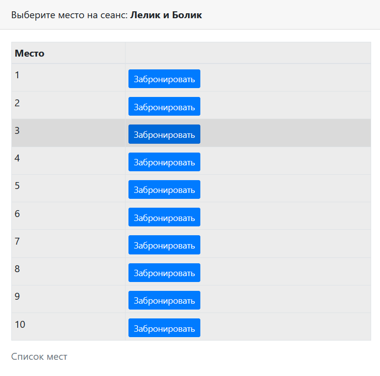
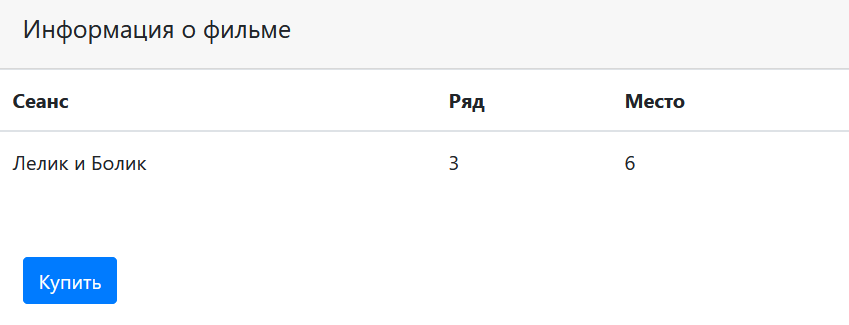

# Репозиторий для третьего уровня курса job4j_cinema

#Описание
Тестовое задание по созданию проекта сайта для кинотеатра.
Проект представляет собой простой сайт для покупки билетов на сеанс фильма. 

#Стек технологий 


#Требуемые программы и запуск.
Для запуска проекта потребуется: 
- Java 8 и выше
- Maven 3.8, 
- PostgresSQL 14

Перед использованием проекта необходимо создать базу данных:
```create database cinema;```. Далее, нужно запустить приложение командой ```mvn spring-boot:run```

#Как использовать 
Афиша сайта



Для покупки билетов необходимо будет авторизоваться или зарегистрироваться.





После выбора фильма мы можем выбрать ряд и место в ряду.





А далее купить билет, увидев всю информацию


#Контакты
Для более глубокой проработки вопросов со мной можно связаться по почте: kshift84@gmail.com;