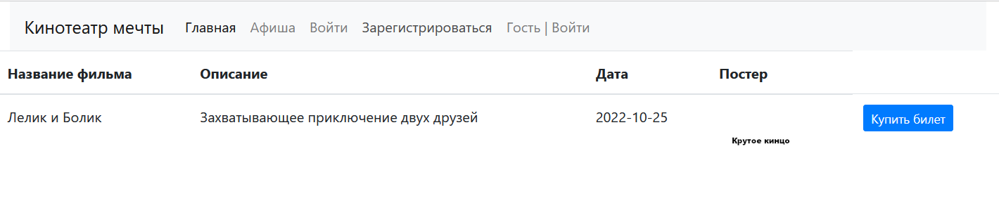
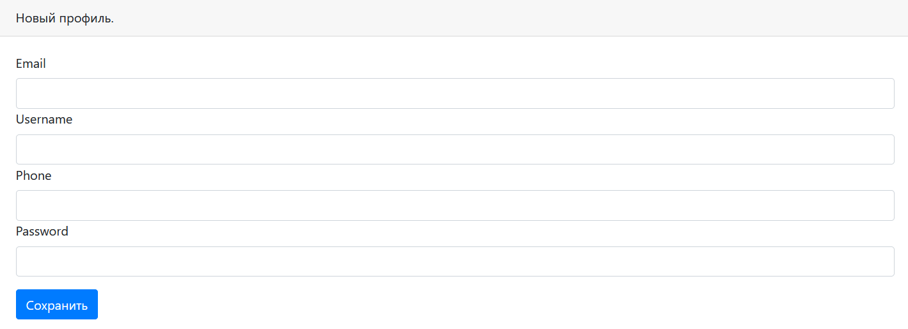
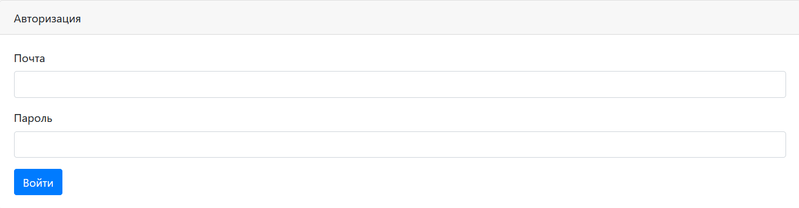
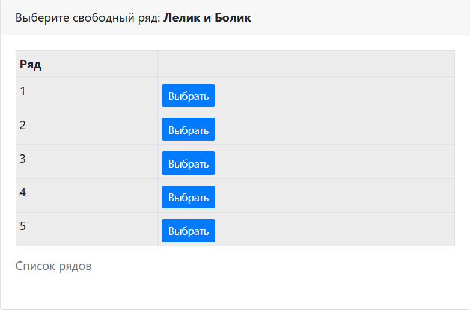
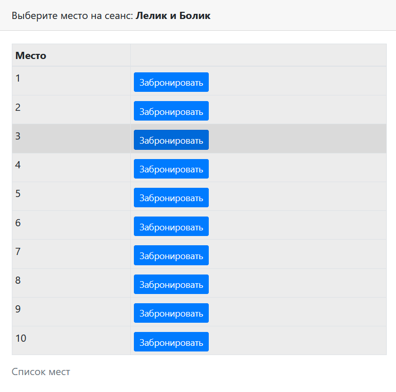
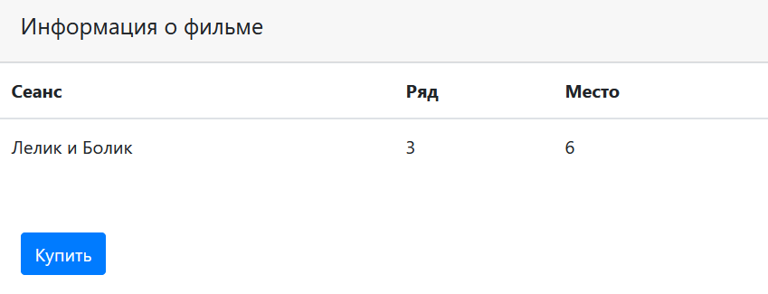

# Репозиторий для третьего уровня курса job4j
Тестовое задание по созданию проекта сайта для кинотеатра.
Проект представляет собой простой сайт для покупки билетов на сеанс фильма. 


Для запуска проекта потребуется: Java 8 и выше, Maven 3.8, PostgreSQL 14

Перед использованием проекта необходимо создать базу данных:
```create database cinema;```, а так же создать необходимые таблицы.

Афиша сайта



Для покупки билетов необходимо будет авторизоваться или зарегистрироваться.





После выбора фильма мы можем выбрать ряд и место в ряду.





А далее купить билет, увидев всю информацию



Для более глубокой проработки вопросов со мной можно связаться по почте: kshift84@gmail.com;